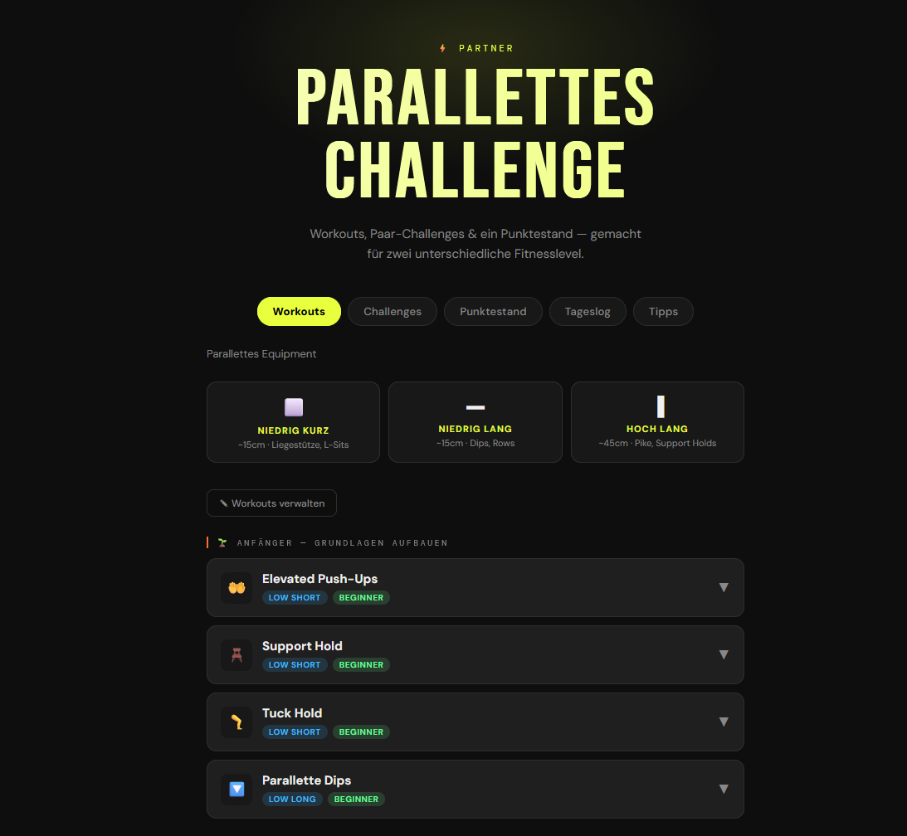

# Parallettes Couple Challenge

A workout tracker for two people doing parallettes exercises together. Challenges are scored on **relative improvement** — your personal best is your baseline, so different fitness levels stay competitive.



## Stack

- **Backend** — Go (`net/http`, `database/sql`, `modernc.org/sqlite`)
- **Frontend** — React + Vite (TypeScript), embedded into the Go binary at build time
- **Database** — SQLite, persisted via a Docker volume

## Running with Docker

```bash
docker compose up --build
```

Open `http://localhost:8080` from any browser on your home network. Data survives restarts via a named Docker volume (`db-data`).

To pull a pre-built image instead of building locally:

```bash
# replace <user> with the GitHub username hosting the repo
docker pull ghcr.io/creadicted/parallettes:latest
```

## Running on NixOS

Add to your NixOS configuration:

```nix
virtualisation.oci-containers.containers.parallettes = {
  image = "ghcr.io/creadicted/parallettes:latest";
  ports = [ "8080:3000" ];
  environment.DB_PATH = "/data/parallettes.db";
  volumes = [ "parallettes-data:/data" ];
  autoStart = true;
};
```

Then `nixos-rebuild switch`. The container starts automatically on boot and restarts on failure.

## Running locally (dev)

**Backend** (serves the API on `:8787`):
```bash
cd backend
go run .
```

**Frontend** (in a second terminal, proxies `/api` to `:8787`):
```bash
cd frontend
npm install
npm run dev
# App on http://localhost:5173
```

**Reset the database:**
```bash
make purge
```

## Project structure

```
parallettes/
├── .github/workflows/build.yml    # CI: test + push to ghcr.io
├── backend/
│   ├── main.go                    # HTTP server, routing, static file serving
│   ├── static/                    # Vite build output (embedded at compile time)
│   └── internal/
│       ├── model/model.go         # Shared types
│       ├── db/db.go               # SQLite schema, queries, seed data
│       ├── service/service.go     # Scoring logic, business rules
│       └── handler/handler.go    # HTTP handlers
├── frontend/
│   └── src/
│       ├── app.tsx                # Routing, global state, API calls
│       ├── styles.css
│       └── components/
│           ├── WorkoutsTab.tsx
│           ├── ChallengesTab.tsx
│           ├── ChallengeOverlay.tsx
│           ├── DailyTab.tsx
│           ├── TrackerTab.tsx
│           ├── SettingsTab.tsx
│           ├── EditWorkoutsTab.tsx
│           └── TipsTab.tsx
├── Dockerfile                     # 3-stage: node → go (embed) → alpine
└── docker-compose.yml
```

## API

### Players
| Method | Path | Description |
|---|---|---|
| `GET` | `/api/players` | List both players |
| `PUT` | `/api/players/{id}` | Update name, color, initials |

### Workouts
| Method | Path | Description |
|---|---|---|
| `GET` | `/api/workouts` | List all workouts |
| `POST` | `/api/workouts` | Create a workout |
| `PUT` | `/api/workouts/{id}` | Update a workout |
| `DELETE` | `/api/workouts/{id}` | Delete a workout |

### Daily log
| Method | Path | Description |
|---|---|---|
| `GET` | `/api/daily?date=YYYY-MM-DD` | Logged entries for a date |
| `POST` | `/api/daily` | Add a log entry |
| `DELETE` | `/api/daily/{id}?date=YYYY-MM-DD` | Remove a log entry |
| `GET` | `/api/daily/month?year=&month=` | Activity map `{"2026-04-15":[1,2]}` for calendar dots |

### Challenges & runs
| Method | Path | Description |
|---|---|---|
| `GET` | `/api/challenges` | List all challenge definitions |
| `GET` | `/api/challenges/active` | Current active run (or `null`) |
| `GET` | `/api/challenges/month?year=&month=` | Runs overlapping a month (for calendar stripe) |
| `POST` | `/api/challenges/runs` | Start a challenge run |
| `PUT` | `/api/challenges/runs/{id}/complete` | Mark a run as completed |
| `DELETE` | `/api/challenges/runs/{id}` | Cancel a run |

### Tracker (points history)
| Method | Path | Description |
|---|---|---|
| `GET` | `/api/state` | Current scores and full history |
| `POST` | `/api/log` | Log a challenge result, returns updated state |
| `DELETE` | `/api/state` | Reset all scores and history |

### Misc
| Method | Path | Description |
|---|---|---|
| `GET` | `/api/db/export` | Download the raw SQLite file |

## Scoring

Each challenge compares **percentage improvement** over each person's own baseline:

- Difference > 5% → winner gets **3 pts**, other gets **0**
- Difference ≤ 5% → both get **1 pt** (tie)
- Time-based challenges (unit contains "lower") invert the calculation automatically
